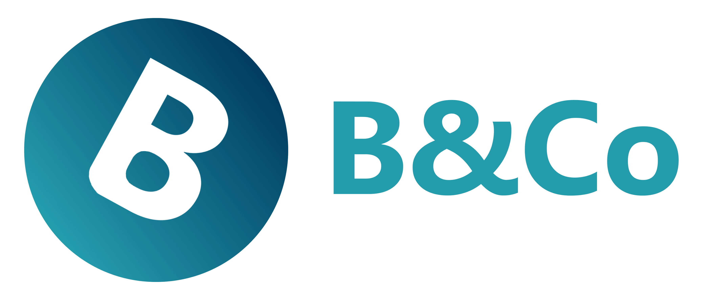

  

  <strong>Brighton and Co Version 5</strong> — The latest version of the Brighton and Co site, made using Velocity.

  
  
  
  

## What is Brighton and Co?

  <strong>The site is currently still in active development - public beta.</strong>

Brighton and Co is the personal website of Harry B, to showcase personal interests, hobbies and ideas. It is a personal project.

## What's New?

- **1. A Complete Redesign** - A new, refreshed design that looks and feels much more polished
- **2. New Branding** - A new colour scheme and Brighton and Co logos, reflecting the newness of the site
- **3. More Optimised** — Extra attention has been placed on ensuring the site is as lightweight and efficient as possible
- **4. More Potential** — With a different philosophy behind designing the site, customisability and modularity means the possibilities for Brighton and Co Version 5 are even greater
- **5. More User-Friendly** — Instead of using Google Forms, Brighton and Co Version 5 now has a native contact form instead
- **6. A Simpler Approach** — Adaptable design, reducing clutter and overload depending on your device.

## Information

### Contact

To contact Brighton and Co, fill out the form [here](https://new.brightonandco.co.uk/contact/)

#### Terms and Conditions
For full terms and conditions for the Brighton and Co site, please see [here](https://new.brightonandco.co.uk/terms-and-conditions/)

#### Licence

MIT — see [LICENCE](LICENSE) for details.

---
**Links**: [GitHub](https://github.com/web-bandco) | [Astro](https://docs.astro.build) | [Tailwind v4](https://tailwindcss.com/docs)

**Brighton and Co Version 5, by [Harry B](https://brightonandco.co.uk)**

---

  <a href="https://new.brightonandco.co.uk">

